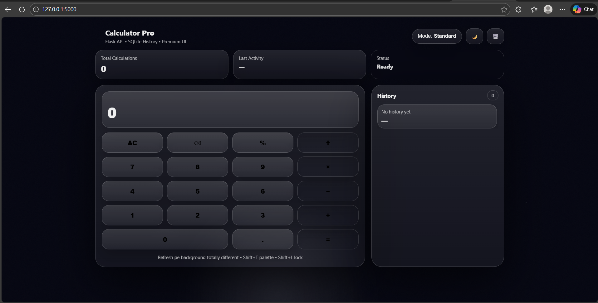

<div align="center">

# 🧮 Calculator Pro
### Premium 3D Calculator Web App • Flask + SQLite

<p align="center">
  
</p>

<br/>

**Calculator Pro** is a product-style calculator with a **3D glass UI**,  
**animated dynamic background**, **standard + scientific mode**, and a **secure Flask backend**  
that stores calculation history in SQLite.

</div>

---

## 🚀 Highlights

- 🧊 **True 3D Glassmorphism UI**
  - Real-time **tilt + glare** interaction
  - Depth-based cards, buttons, and panels
- 🌌 **Premium Animated Background**
  - Aurora gradients + floating blobs + starfield + grain texture
  - Palette shifts for a “wow on refresh” feel
- 🧮 **Standard + Scientific Mode**
  - `sin`, `cos`, `tan`
  - `log`, `ln`, `sqrt`
  - constants: `pi`, `e`
  - power: `**` (xʸ)
- 🗂️ **SQLite History**
  - Stores expressions, results, mode, and timestamps
- 🔒 **Safe Backend Evaluation**
  - No unsafe evaluation patterns
  - Expression parsing with strict allow-list rules
- ⌨️ **Keyboard Friendly**
  - Enter, Backspace, Esc + operators
- 🌙 **Dark/Light Mode**
- 📱 **Responsive Layout** (Desktop + Mobile)

---

## 🧠 Why this project is different

Most calculators are static frontends.  
This one behaves like a **mini product**:

- UI feels **premium & interactive** (3D + micro-animations)
- Backend adds **real persistence** (history + timestamps)
- Safer evaluation approach (no raw eval usage)
- Clean structure → GitHub-ready

---

## 🛠 Tech Stack

**Frontend**
- HTML5
- CSS3 (3D transforms, glass UI, animations)
- Vanilla JavaScript

**Backend**
- Python
- Flask
- SQLite

---

## 📂 Project Structure

```txt
Calculator/
│── app.py
│── requirements.txt
│── README.md
│── .gitignore
│
├── templates/
│   └── index.html
│
└── static/
    ├── css/
    │   └── style.css
    ├── js/
    │   └── main.js
    ├── preview.png
